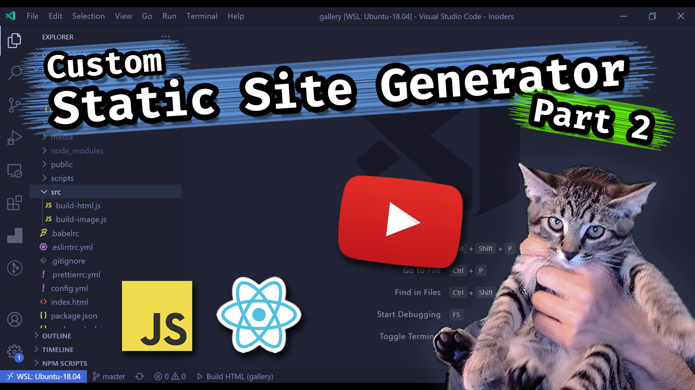

# Custom Static Site Gallery for Mojo

Deploys to: https://mojo.joel.net

## Live Coding

Watch as I Live Code this Custom Static Site Generator

### Constraining Images and Creating Thumbs

[](https://www.youtube.com/watch?v=inAWGWfpkHs)

### Rendering the HTML (with React)

[](https://www.youtube.com/watch?v=UCWxte7IqME)

## Building Images

The images are processed from a `media` directory that is not checked into the repo.
This way, EXIF data is stripped before going public.

The "full" size images in `public` are now constrained by size and compressed to save file size.

```bash
# install dependencies
$ npm ci

# start local webserver and build html
$ npm run build:images
```

## Starting Locally

```bash
# install dependencies
$ npm ci

# start local webserver and build html
$ npm run dev
```

## Debugging

There are two debug configurations, one for debugging the image generation and another for the HTML. This is because these two processed have been separated.

Select a configuration from the Debug panel, then `Start Debugging`.

- Build Images
- Build HTML
